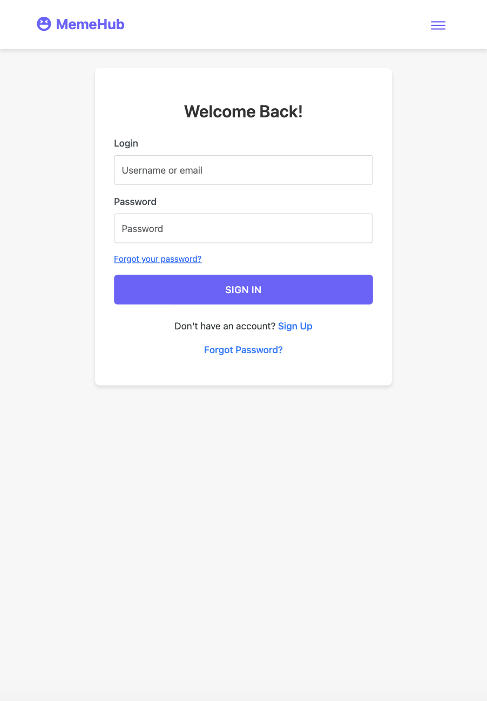
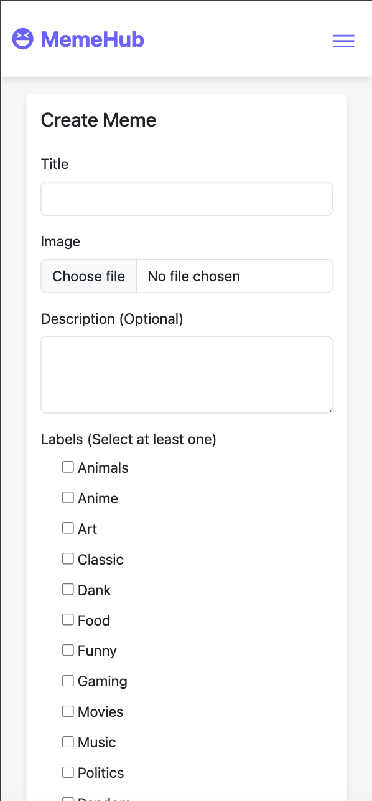
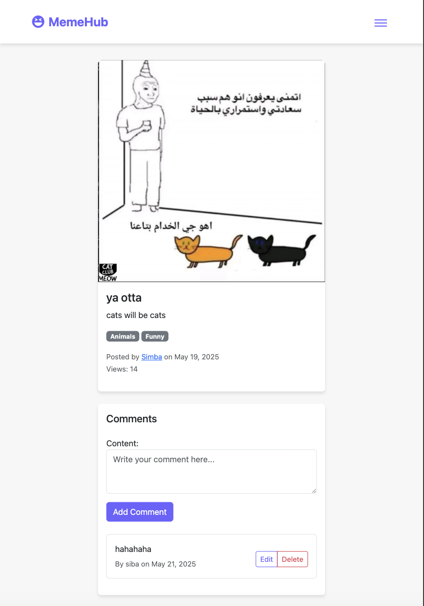
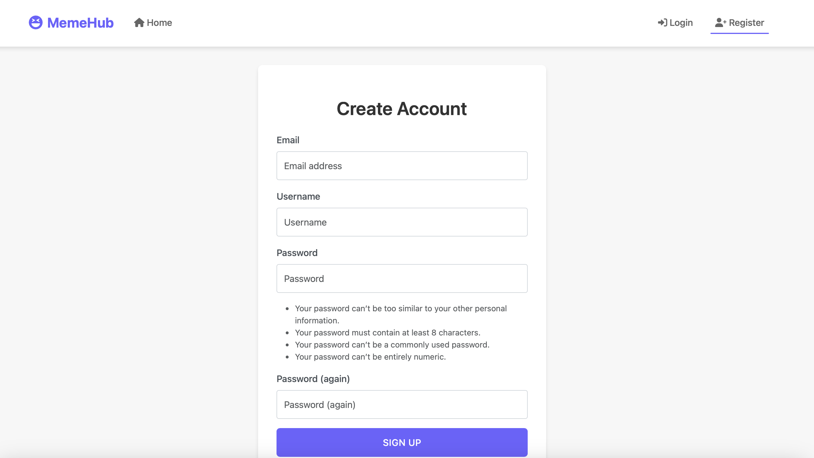
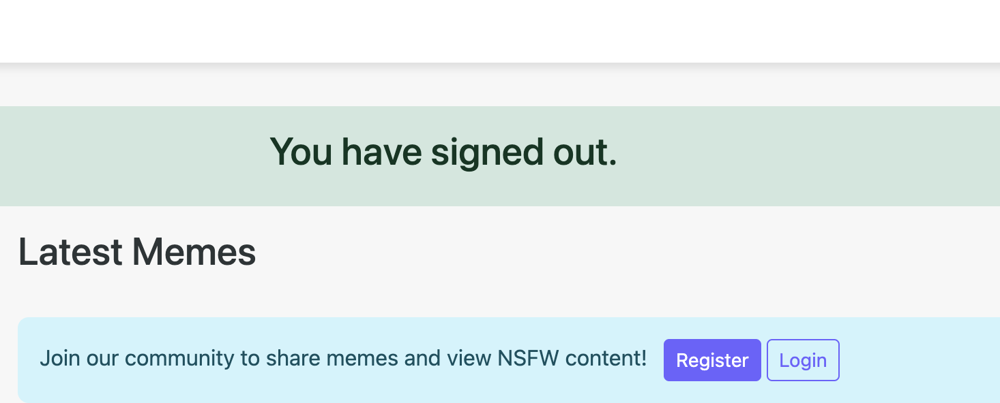
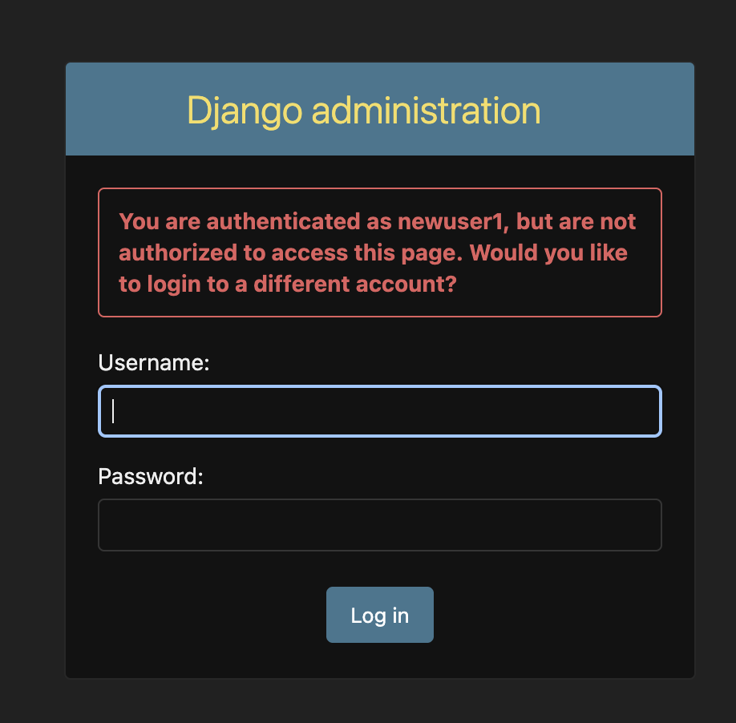

# Testing

> [!NOTE]
> Return back to the [README.md](README.md) file.

## Code Validation

### HTML

I have used the recommended [HTML W3C Validator](https://validator.w3.org) to validate all of my HTML files.

| Directory | File | Screenshot |
| --- | --- | --- |
| templates | [404.html](https://github.com/allaafaham/meme-hub/blob/main/templates/core/404.html) |  |
| templates | [comment_confirm_delete.html](https://github.com/allaafaham/meme-hub/blob/main/templates/core/comment_confirm_delete.html) |  |
| templates | [comment_form.html](https://github.com/allaafaham/meme-hub/blob/main/templates/core/comment_form.html) |  |
| templates | [home.html](https://github.com/allaafaham/meme-hub/blob/main/templates/core/home.html) |  |
| templates | [login.html](https://github.com/allaafaham/meme-hub/blob/main/templates/core/login.html) |  |
| templates | [meme_confirm_delete.html](https://github.com/allaafaham/meme-hub/blob/main/templates/core/meme_confirm_delete.html) |  
| templates | [meme_detail.html](https://github.com/allaafaham/meme-hub/blob/main/templates/core/meme_detail.html) |  |
| templates | [meme_form.html](https://github.com/allaafaham/meme-hub/blob/main/templates/core/meme_form.html) |  |
| templates | [profile.html](https://github.com/allaafaham/meme-hub/blob/main/templates/core/profile.html) |  |
| templates | [register.html](https://github.com/allaafaham/meme-hub/blob/main/templates/core/register.html) |  |

### CSS

I have used the recommended [CSS Jigsaw Validator](https://jigsaw.w3.org/css-validator) to validate all of my CSS files.

| Directory | File | Screenshot |
| --- | --- | --- |
| static | [style.css](https://github.com/allaafaham/meme-hub/blob/main/static/css/style.css) |  |

### Python

I have used the recommended [PEP8 CI Python Linter](https://pep8ci.herokuapp.com) to validate all of my Python files.

| Directory | File | URL | Screenshot | Notes |
| --- | --- | --- | --- | --- |
| core | [admin.py](https://github.com/allaafaham/meme-hub/blob/main/core/admin.py) | [PEP8 CI Link](https://pep8ci.herokuapp.com/https://raw.githubusercontent.com/allaafaham/meme-hub/main/core/admin.py) |  | Notes (if applicable) |
| core | [forms.py](https://github.com/allaafaham/meme-hub/blob/main/core/forms.py) | [PEP8 CI Link](https://pep8ci.herokuapp.com/https://raw.githubusercontent.com/allaafaham/meme-hub/main/core/forms.py) |  | Notes (if applicable) |
| core | [create_labels.py](https://github.com/allaafaham/meme-hub/blob/main/core/management/commands/create_labels.py) | [PEP8 CI Link](https://pep8ci.herokuapp.com/https://raw.githubusercontent.com/allaafaham/meme-hub/main/core/management/commands/create_labels.py) |  | Notes (if applicable) |
| core | [models.py](https://github.com/allaafaham/meme-hub/blob/main/core/models.py) | [PEP8 CI Link](https://pep8ci.herokuapp.com/https://raw.githubusercontent.com/allaafaham/meme-hub/main/core/models.py) |  | Notes (if applicable) |
| core | [urls.py](https://github.com/allaafaham/meme-hub/blob/main/core/urls.py) | [PEP8 CI Link](https://pep8ci.herokuapp.com/https://raw.githubusercontent.com/allaafaham/meme-hub/main/core/urls.py) |  | Notes (if applicable) |
| core | [views.py](https://github.com/allaafaham/meme-hub/blob/main/core/views.py) | [PEP8 CI Link](https://pep8ci.herokuapp.com/https://raw.githubusercontent.com/allaafaham/meme-hub/main/core/views.py) |  | Notes (if applicable) |
| memehub | [settings.py](https://github.com/allaafaham/meme-hub/blob/main/memehub/settings.py) | [PEP8 CI Link](https://pep8ci.herokuapp.com/https://raw.githubusercontent.com/allaafaham/meme-hub/main/memehub/settings.py) |  | Notes (if applicable) |
| memehub | [urls.py](https://github.com/allaafaham/meme-hub/blob/main/memehub/urls.py) | [PEP8 CI Link](https://pep8ci.herokuapp.com/https://raw.githubusercontent.com/allaafaham/meme-hub/main/memehub/urls.py) |  | Notes (if applicable) |
| memehub | [views.py](https://github.com/allaafaham/meme-hub/blob/main/memehub/views.py) | [PEP8 CI Link](https://pep8ci.herokuapp.com/https://raw.githubusercontent.com/allaafaham/meme-hub/main/memehub/views.py) |  | Notes (if applicable) |

## Responsiveness

I've tested my deployed project to check for responsiveness issues.

| Page        | Mobile                                                                 | Tablet                                                                 | Desktop                                                                 | Notes             |
|-------------|------------------------------------------------------------------------|------------------------------------------------------------------------|-------------------------------------------------------------------------|-------------------|
| Register    |         |         |         | Works as expected |
| Login       |            |            |            | Works as expected |
| Home        |             |             |             | Works as expected |
| Create Meme |         |         |         | Works as expected |
| Edit Meme   |        |        |        | Works as expected |
| Meme Page   |        |        |        | Works as expected |
| 404         |              |              |              | Works as expected |

## Browser Compatibility

I've tested my deployed project on multiple browsers to check for compatibility issues.

| Page        | Chrome                                                           | Firefox                                                          | Safari                                                           | Notes             |
|-------------|------------------------------------------------------------------|------------------------------------------------------------------|------------------------------------------------------------------|-------------------|
| Register    |         |         |         | Works as expected |
| Login       |            |            |            | Works as expected |
| Home        |             |             |             | Works as expected |
| Create Meme |         |         |         | Works as expected |
| Edit Meme   |        |        |        | Works as expected |
| Meme Page   |        |        |        | Works as expected |
| 404         |              |              |              | Works as expected |

## Lighthouse Audit

I've tested my deployed project using the Lighthouse Audit tool to check for any major issues. Some warnings are outside of my control, and mobile results tend to be lower than desktop.

| Page        | Mobile                                                           | Desktop                                                          |
|-------------|------------------------------------------------------------------|------------------------------------------------------------------|
| Register    |       |      |
| Login       |          |         |
| Home        |           |          |
| Create Meme |       |      |
| Edit Meme   |      |     |
| Meme Page   |      |     |
| 404         |            |           |

## Defensive Programming

Defensive programming was manually tested with the below user acceptance testing:

| Page/Feature      | Expectation | Test | Result | Screenshot |
|-------------------|-------------|------|--------|------------|
| Meme Management   | Feature is expected to allow users to create new memes with a title, image, and description. | Created a new meme with valid title, image, and description. | Meme was created successfully and displayed correctly. |  |
|                   | Feature is expected to allow users to update existing memes. | Edited the content of an existing meme. | Meme was updated successfully with the new content. |  |
|                   | Feature is expected to allow users to delete memes. | Attempted to delete a meme, confirming the action before proceeding. | Meme was deleted successfully. |  |
|                   | Feature is expected to retrieve a list of all uploaded memes. | Accessed the user profile/dashboard to view all uploaded memes. | All uploaded memes were displayed in a list view. |  |
| Comments          | Feature is expected to allow users to add comments to memes. | Logged in and added comments to a meme. | Comments were successfully added and displayed. |  |
|                   | Feature is expected to allow users to edit or delete their own comments. | Edited and deleted personal comments. | Comments were updated or removed as expected. |  |
| User Authentication | Feature is expected to allow registered users to log in to the site. | Attempted to log in with valid and invalid credentials. | Login was successful with valid credentials; invalid credentials were rejected. |  |
|                   | Feature is expected to allow users to register for an account. | Registered a new user with unique credentials. | User account was created successfully. |  |
|                   | Feature is expected to allow users to log out securely. | Logged out and tried accessing a restricted page. | Access was denied after logout, as expected. |  |
| Guest Features    | Feature is expected to allow guest users to view memes without registering. | Opened meme pages as a guest user. | Memes were fully accessible without logging in. |  |
|                   | Feature is expected to display the names of commenters on memes. | Checked the names of commenters on memes as a guest user. | Commenter names were displayed as expected. |  |
|                   | Feature is expected to block standard users from brute-forcing admin pages. | Attempted to navigate to admin-only pages by manipulating the URL (e.g., `/admin`). | Access was blocked, and a message was displayed showing denied access. |  |
| 404 Error Page    | Feature is expected to display a 404 error page for non-existent pages. | Navigated to an invalid URL (e.g., `/test`). | A custom 404 error page was displayed as expected. |  |

## User Story Testing

## User Story Testing

| Target | Expectation | Outcome | Pass |
| --- | --- | --- | --- |
| As a user | I want to register for an account | so that I can access meme-hub features and personalize my experience. | x |
| As a user | I want to log in to my account | so that I can securely access my profile and interact with memes. | x |
| As a user | I want to manage my profile | so that I can update my personal information and preferences. | x |
| As a user | I want to upload memes | so that I can share my creations with the community. | x |
| As a user | I want to view memes | so that I can browse and enjoy content shared by others. | x |
| As a user | I want to like memes | so that I can show appreciation for content I enjoy. | x |
| As a user | I want to comment on memes | so that I can engage in discussions and provide feedback. | x |
| As a user | I want to manage meme labels | so that I can organize and categorize memes for easier discovery. | x |

## Bugs

There are no remaining bugs that I am aware of, though, even after thorough testing, I cannot rule out the possibility.

